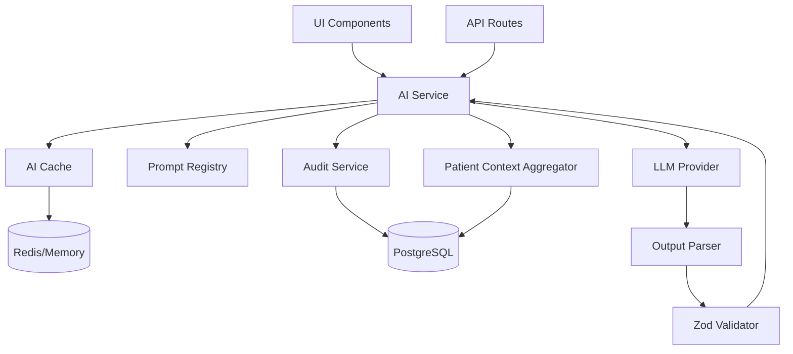
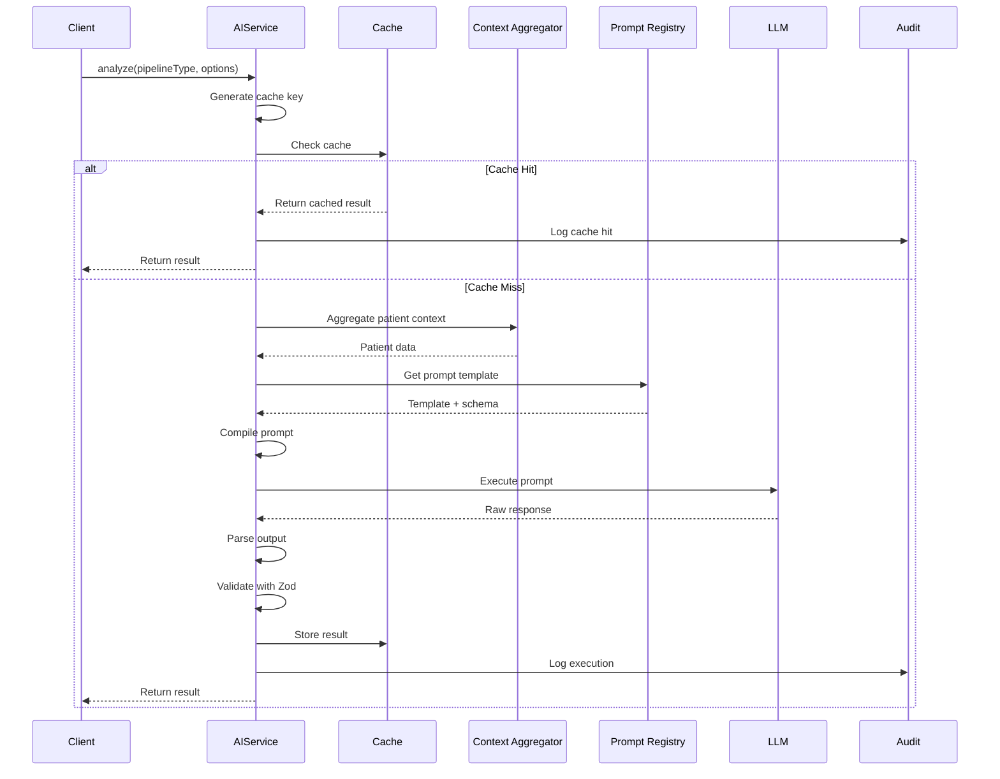

# AI Service Architecture Design

## Overview

The AI Service Layer provides a centralized interface for all LLM interactions in the EHR system. This layer abstracts the complexity of prompt management, context aggregation, caching, and auditing while ensuring consistent error handling and performance monitoring.

## Architecture Goals

1. **Centralization**: Single entry point for all AI operations
2. **Performance**: Sub-500ms response times with intelligent caching
3. **Reliability**: Comprehensive error handling and fallback mechanisms
4. **Observability**: Full audit trail and performance metrics
5. **Type Safety**: End-to-end TypeScript support with Zod validation
6. **Modularity**: Clean separation of concerns

## High-Level Architecture



## Core Components

### 1. AI Service Interface

```typescript
interface AIService {
  // Main execution method
  analyze<T extends PipelineType>(
    pipelineType: T,
    options: AIExecutionOptions<T>
  ): Promise<AIServiceResult<T>>;
  
  // Batch operations
  analyzeBatch<T extends PipelineType>(
    requests: BatchRequest<T>[]
  ): Promise<BatchResult<T>[]>;
  
  // Cache management
  invalidateCache(pattern?: string): Promise<void>;
  getCacheStats(): Promise<CacheStats>;
  
  // Health check
  healthCheck(): Promise<HealthStatus>;
}

interface AIExecutionOptions<T extends PipelineType> {
  patientId: string;
  sessionId?: string;
  purpose: T;
  variables?: Record<string, any>;
  skipCache?: boolean;
  priority?: 'low' | 'normal' | 'high';
  metadata?: Record<string, any>;
}

interface AIServiceResult<T extends PipelineType> {
  success: boolean;
  data?: InferredOutput<T>;
  error?: AIServiceError;
  metadata: {
    executionId: string;
    pipelineType: T;
    promptVersion: string;
    modelUsed: string;
    tokenUsage: TokenUsage;
    latencyMs: number;
    cacheHit: boolean;
    timestamp: Date;
  };
}
```

### 2. Service Class Structure

```typescript
class AIServiceImpl implements AIService {
  private contextAggregator: PatientContextService;
  private promptRegistry: PromptRegistry;
  private cache: AICache;
  private auditService: AuditService;
  private outputParser: OutputParser;
  private llmExecutor: LLMExecutor;
  
  constructor(dependencies: AIServiceDependencies) {
    // Dependency injection
  }
  
  async analyze<T extends PipelineType>(
    pipelineType: T,
    options: AIExecutionOptions<T>
  ): Promise<AIServiceResult<T>> {
    // Main execution flow
  }
  
  private async executeWithRetry(
    prompt: CompiledPrompt,
    config: ExecutionConfig
  ): Promise<LLMResponse> {
    // Retry logic with exponential backoff
  }
  
  private async validateOutput<T>(
    output: unknown,
    schema: ZodSchema<T>
  ): Promise<T> {
    // Zod validation with error mapping
  }
}
```

### 3. Caching Strategy

#### Cache Key Generation
```typescript
interface CacheKeyGenerator {
  generate(params: {
    pipelineType: string;
    patientId: string;
    promptVersion: string;
    variables: Record<string, any>;
  }): string;
}

// Example: "ai:safety-check:patient-123:v1.0.0:hash(vars)"
```

#### Cache Configuration
```typescript
interface CacheConfig {
  // TTL by pipeline type
  ttl: {
    safety_check: 300,        // 5 minutes
    billing_cpt: 3600,        // 1 hour
    billing_icd10: 3600,      // 1 hour
    treatment_progress: 1800, // 30 minutes
    default: 600              // 10 minutes
  };
  
  // Maximum cache size
  maxSize: 1000;
  
  // Eviction policy
  evictionPolicy: 'LRU' | 'LFU';
  
  // Cache levels
  levels: {
    l1: 'memory';  // Fast, limited size
    l2: 'redis';   // Slower, larger capacity
  };
}
```

#### Cache Implementation Options

**Option 1: In-Memory Cache (Development)**
```typescript
class InMemoryAICache implements AICache {
  private cache: Map<string, CachedItem>;
  private lru: LRUCache<string, CachedItem>;
  
  async get(key: string): Promise<CachedItem | null> {
    const item = this.lru.get(key);
    if (item && !this.isExpired(item)) {
      return item;
    }
    return null;
  }
}
```

**Option 2: Redis Cache (Production)**
```typescript
class RedisAICache implements AICache {
  private redis: Redis;
  private memoryCache: LRUCache<string, CachedItem>;
  
  async get(key: string): Promise<CachedItem | null> {
    // L1 check (memory)
    const l1Result = this.memoryCache.get(key);
    if (l1Result) return l1Result;
    
    // L2 check (Redis)
    const l2Result = await this.redis.get(key);
    if (l2Result) {
      this.memoryCache.set(key, l2Result);
      return l2Result;
    }
    
    return null;
  }
}
```

### 4. Error Handling Strategy

```typescript
class AIServiceError extends Error {
  constructor(
    public code: AIErrorCode,
    public message: string,
    public context?: Record<string, any>,
    public cause?: Error
  ) {
    super(message);
  }
}

enum AIErrorCode {
  // Context errors
  CONTEXT_AGGREGATION_FAILED = 'CONTEXT_001',
  PATIENT_NOT_FOUND = 'CONTEXT_002',
  
  // Prompt errors
  PROMPT_NOT_FOUND = 'PROMPT_001',
  PROMPT_COMPILATION_FAILED = 'PROMPT_002',
  
  // LLM errors
  LLM_TIMEOUT = 'LLM_001',
  LLM_RATE_LIMIT = 'LLM_002',
  LLM_INVALID_RESPONSE = 'LLM_003',
  
  // Validation errors
  OUTPUT_VALIDATION_FAILED = 'VALIDATION_001',
  SCHEMA_MISMATCH = 'VALIDATION_002',
  
  // System errors
  CACHE_ERROR = 'SYSTEM_001',
  AUDIT_ERROR = 'SYSTEM_002',
}

// Error recovery strategies
interface ErrorRecovery {
  [AIErrorCode.LLM_TIMEOUT]: {
    strategy: 'retry';
    maxAttempts: 3;
    backoff: 'exponential';
  };
  [AIErrorCode.LLM_RATE_LIMIT]: {
    strategy: 'queue';
    delayMs: 60000;
  };
  [AIErrorCode.OUTPUT_VALIDATION_FAILED]: {
    strategy: 'fallback';
    action: 'use_simplified_prompt';
  };
}
```

### 5. Logging Strategy

```typescript
interface AIServiceLogger {
  // Structured logging with context
  logExecution(params: {
    executionId: string;
    pipelineType: string;
    phase: 'start' | 'context' | 'prompt' | 'llm' | 'parse' | 'validate' | 'complete';
    metadata?: Record<string, any>;
  }): void;
  
  // Performance metrics
  logPerformance(metrics: {
    executionId: string;
    phase: string;
    durationMs: number;
    tokenCount?: number;
  }): void;
  
  // Error logging
  logError(error: AIServiceError, context: ExecutionContext): void;
}

// Log format examples:
// [AI-Service] [exec-123] [safety_check] Starting execution
// [AI-Service] [exec-123] [safety_check] Context aggregation: 45ms
// [AI-Service] [exec-123] [safety_check] LLM call: 234ms, 1523 tokens
// [AI-Service] [exec-123] [safety_check] Cache hit, returning cached result
// [AI-Service] [exec-123] [safety_check] ERROR: LLM timeout after 5000ms
```

## Execution Flow



## Integration Points

### 1. With Existing Components

```typescript
// Integration with Patient Context Aggregator
const context = await this.contextAggregator.aggregateContext({
  patientId: options.patientId,
  purpose: options.purpose,
  maxTokens: 3000 // Leave room for prompt
});

// Integration with Prompt Registry
const template = await this.promptRegistry.get(
  this.getPipelinePromptId(pipelineType)
);

// Compile prompt with context
const compiledPrompt = await this.compilePrompt(template, {
  ...context,
  ...options.variables
});
```

### 2. With UI Components

```typescript
// In React components
const { analyze } = useAIService();

const handleSafetyCheck = async () => {
  const result = await analyze('safety_check', {
    patientId: session.patientId,
    sessionId: session.id,
  });
  
  if (result.success) {
    setSafetyFlags(result.data.flags);
  }
};
```

### 3. With API Routes

```typescript
// In Next.js API routes
export async function POST(req: Request) {
  const aiService = createAIService();
  
  const result = await aiService.analyze('billing_cpt', {
    patientId: body.patientId,
    sessionId: body.sessionId,
    variables: {
      visitType: body.visitType,
      duration: body.duration
    }
  });
  
  return Response.json(result);
}
```

## Performance Considerations

### 1. Concurrency Control
```typescript
class ConcurrencyManager {
  private activeRequests = new Map<string, Promise<any>>();
  private maxConcurrent = 10;
  
  async execute<T>(
    key: string,
    fn: () => Promise<T>
  ): Promise<T> {
    // Deduplicate identical requests
    if (this.activeRequests.has(key)) {
      return this.activeRequests.get(key);
    }
    
    // Queue if at capacity
    if (this.activeRequests.size >= this.maxConcurrent) {
      await this.waitForSlot();
    }
    
    const promise = fn();
    this.activeRequests.set(key, promise);
    
    try {
      return await promise;
    } finally {
      this.activeRequests.delete(key);
    }
  }
}
```

### 2. Token Optimization
```typescript
interface TokenOptimizer {
  // Trim context to fit within limits
  optimizeContext(
    context: PatientContext,
    maxTokens: number
  ): PatientContext;
  
  // Estimate tokens before LLM call
  estimateTokens(text: string): number;
  
  // Track token usage patterns
  analyzeUsage(
    pipelineType: string,
    usage: TokenUsage
  ): void;
}
```

## Security Considerations

1. **Input Sanitization**: All user inputs sanitized before prompt compilation
2. **Output Validation**: Strict Zod validation on all LLM outputs
3. **Rate Limiting**: Per-user and per-patient rate limits
4. **Audit Trail**: Complete record of all AI operations
5. **PII Protection**: No PII in cache keys or logs

## Monitoring and Observability

```typescript
interface AIServiceMetrics {
  // Performance metrics
  executionLatency: Histogram;
  cacheHitRate: Gauge;
  tokenUsage: Counter;
  
  // Error metrics
  errorRate: Counter;
  errorsByType: Counter;
  
  // Business metrics
  executionsByPipeline: Counter;
  executionsByUser: Counter;
}
```

## Migration Strategy

1. **Phase 1**: Implement core AI service with in-memory cache
2. **Phase 2**: Add Redis cache for production
3. **Phase 3**: Migrate existing direct LLM calls to use AI service
4. **Phase 4**: Add advanced features (batching, priority queues)

## Next Steps

1. Implement cache layer (Story 5.2)
2. Create audit service (Story 5.3)
3. Build core AI service (Story 5.4)
4. Implement output parser (Story 5.5)
5. Create LLM executor (Story 5.6)
6. Build service factory (Story 5.7)
7. Comprehensive testing (Story 5.8)

## Summary

The AI Service Layer provides a robust, scalable foundation for all AI operations in the EHR system. By centralizing LLM interactions, we gain:

- Consistent error handling and recovery
- Performance optimization through caching
- Complete audit trail for compliance
- Type-safe interfaces throughout
- Easy integration with existing components

This architecture ensures that AI capabilities can be reliably integrated throughout the application while maintaining performance, security, and observability requirements.
