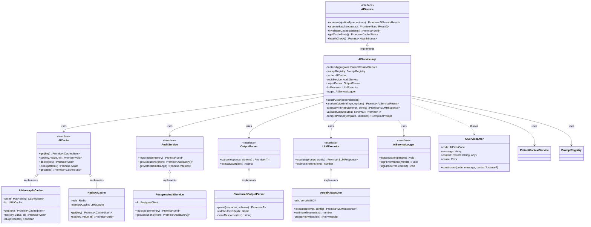
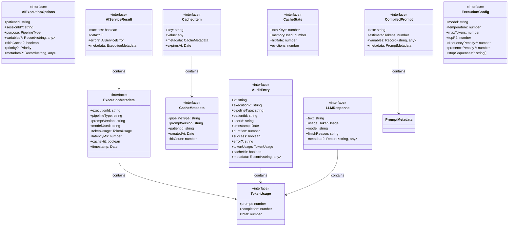
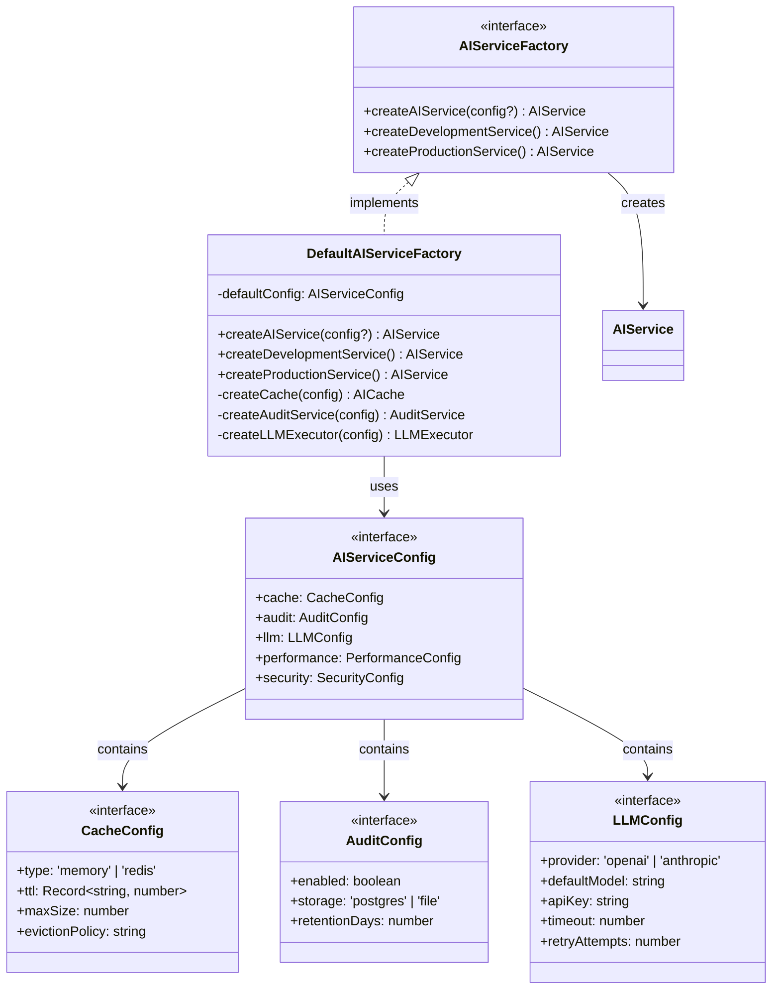
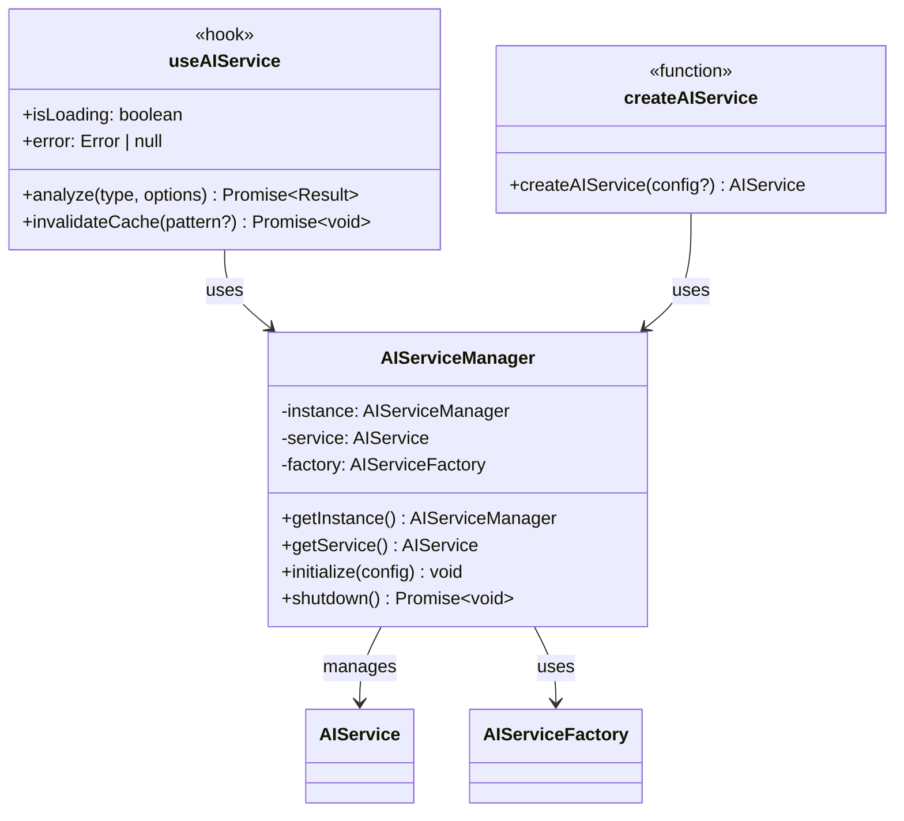

# AI Service Class Diagram

## Core Classes and Interfaces

## Data Types and Interfaces

## Pipeline Type System

```mermaid
classDiagram
    %% Pipeline Type Enum
    class PipelineType {
        <<enumeration>>
        SAFETY_CHECK
        BILLING_CPT
        BILLING_ICD10
        TREATMENT_PROGRESS
        CHAT_WITH_CHART
    }
    
    %% Type Mapping
    class PipelineTypeMap {
        <<interface>>
        +safety_check: SafetyCheckOutput
        +billing_cpt: BillingCPTOutput
        +billing_icd10: BillingICD10Output
        +treatment_progress: TreatmentProgressOutput
        +chat_with_chart: ChatWithChartOutput
    }
    
    %% Output Types
    class SafetyCheckOutput {
        +flags: SafetyFlag[]
        +overallRisk: RiskLevel
        +recommendations: string[]
        +confidence: number
    }
    
    class BillingCPTOutput {
        +codes: CPTCode[]
        +primaryCode: string
        +confidence: number
    }
    
    class BillingICD10Output {
        +diagnoses: Diagnosis[]
        +primaryDiagnosis: string
        +confidence: number
    }
    
    class TreatmentProgressOutput {
        +progress: ProgressIndicator[]
        +summary: string
        +nextSteps: string[]
        +confidence: number
    }
    
    %% Type Helper
    class InferredOutput~T~ {
        <<type>>
        T extends keyof PipelineTypeMap
        PipelineTypeMap[T]
    }
```

## Factory Pattern

## Singleton Pattern for Global Access

## Summary

This class diagram illustrates the complete AI Service architecture with:

1. **Core Services**: Central AIService interface with comprehensive implementation
2. **Supporting Services**: Cache, Audit, Parser, and Executor abstractions
3. **Data Types**: Complete type system for requests, responses, and metadata
4. **Pipeline Types**: Type-safe mapping of pipeline types to outputs
5. **Factory Pattern**: Flexible service creation for different environments
6. **Integration Points**: Singleton manager and React hooks for easy access

The architecture supports:
- Multiple cache implementations (memory/Redis)
- Pluggable LLM providers
- Comprehensive audit logging
- Type-safe pipeline execution
- Performance monitoring
- Error recovery strategies
