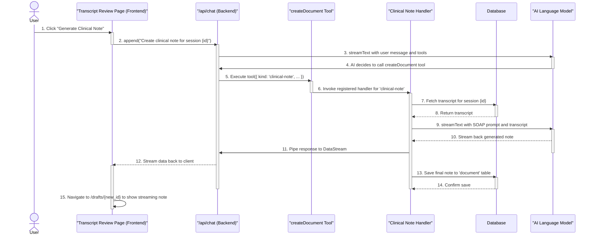

# Note Generation Feature - Implementation Checkpoint #1

## 1. Revised Implementation Plan

After a thorough analysis of the existing codebase, the implementation plan has been revised to leverage the application's existing architecture for generating AI content via tools and streaming responses. Instead of creating a standalone API endpoint for note generation, we will integrate it into the existing chat and artifact system.

This approach ensures consistency, reusability, and maintainability.

## 2. Revised Data Flow

The following diagram illustrates the new data flow for generating a clinical note.

## 3. New Components & Handlers to be Created

*   **`ai-chatbot/lib/artifacts/clinical-note.ts`**: A new artifact handler responsible for the core logic of fetching transcripts, prompting the AI, and saving the result.
*   **`ai-chatbot/lib/ai/prompts/clinical-note-prompt.ts`**: A new, specialized prompt file to instruct the LLM on how to create a well-structured behavioral health SOAP note.
*   **Drizzle Migration File**: A new migration file will be created to add a `sessionId` foreign key to the `document` table, properly linking notes to sessions.

## 4. Files to be Modified

*   **`ai-chatbot/lib/artifacts/server.ts`**: To register the new `clinical-note` handler.
*   **`ai-chatbot/app/dashboard/sessions/[id]/review/page.tsx`**: To change the "Generate Note" button to use the `useChat` hook and call the main chat API.
*   **`ai-chatbot/app/(chat)/api/chat/route.ts`**: To ensure the system prompt and tool parameters can handle the note generation request.
*   **`ai-chatbot/app/dashboard/drafts/[id]/page.tsx`**: To handle the real-time streaming of the generated note.
*   **`ai-chatbot/lib/db/schema.ts`**: To add the `sessionId` to the `document` table schema.
